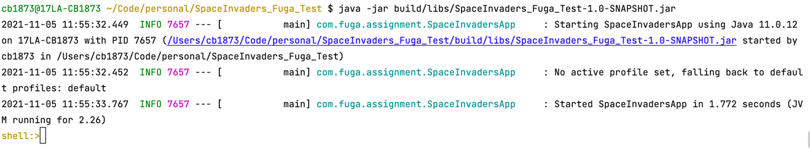
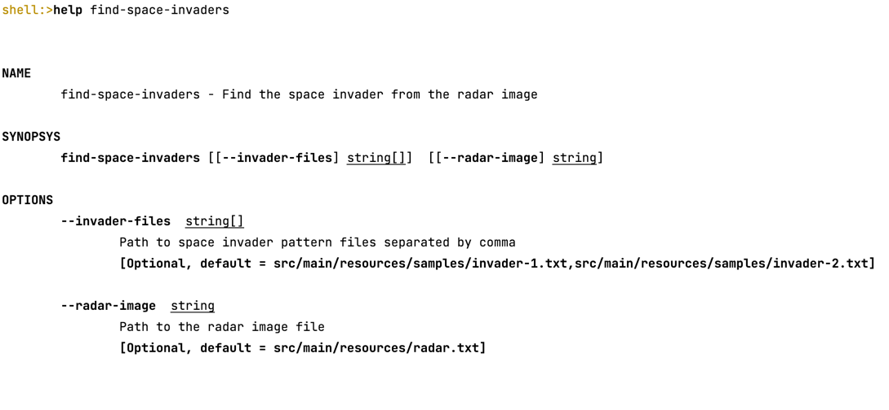
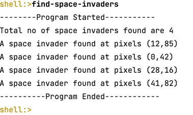

## FUGA Coding Assignment

## Introduction
The Aim of this program is to detect space invaders in a very noisy radar image.

Given few sample files which has the pattern of space invaders and this program matches the pattern provided with 
the pattern present in the radar image and return the x,y coordinates from the radar image where the pattern can 
be found. 

## Implementation
### Framework
The program uses spring boot framework and spring shell starter to create a shell command based execution.
### Dependency Management 
The application uses Gradle tool to manage dependencies.
### Execution Steps
Below steps should be performed to run the program.

1. Build the application using the below gradle command.
    ````
   ./gradlew build
   ````
2. The jar would be available from the above command. Now use the jar file to run the program.
    ````
   java -jar build/libs/SpaceInvaders_Fuga_Test-1.0-SNAPSHOT.jar
   ````
3. The above step would execute the program and provide a shell like environment where the below command should be issued.

    

4. Issue the command 'find-space-invaders' in the shell with the options to execute the program. A Screen shot below
shows the details of the command through help command.

    

5. User can pass different space invader files and radar image and execute the program.

6. Finally, the result will be similar to screenshot below. x,y co-ordinates from the radar image.
   
    

### Note:
The program captures the space invaders from the radar image that matches the pattern of invaders by a percentage of 65%. 
Which means the program do not aim to match exactly considering the false positives and false negatives. 

There is also a scope of having more unit test cases. In the interest of time, only few JUnit test cases are added.  
At the moment there is a test coverage of 81%. 


